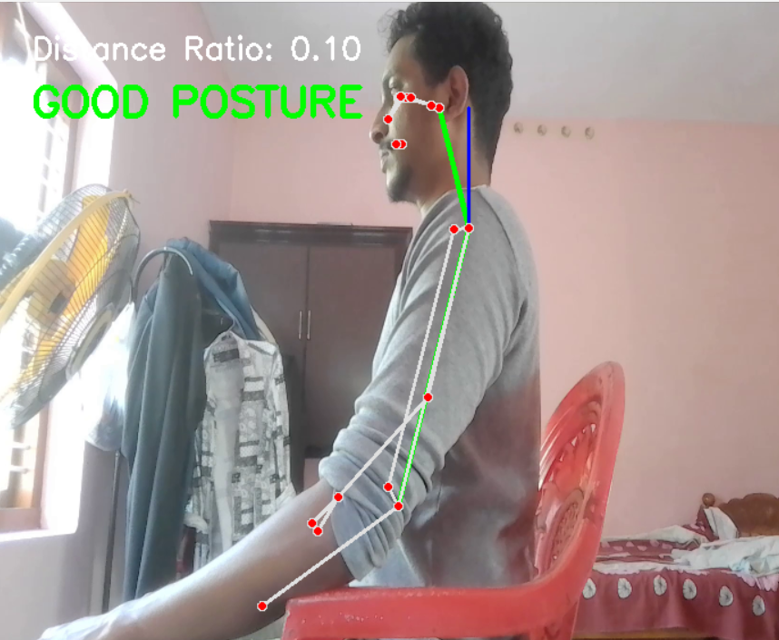
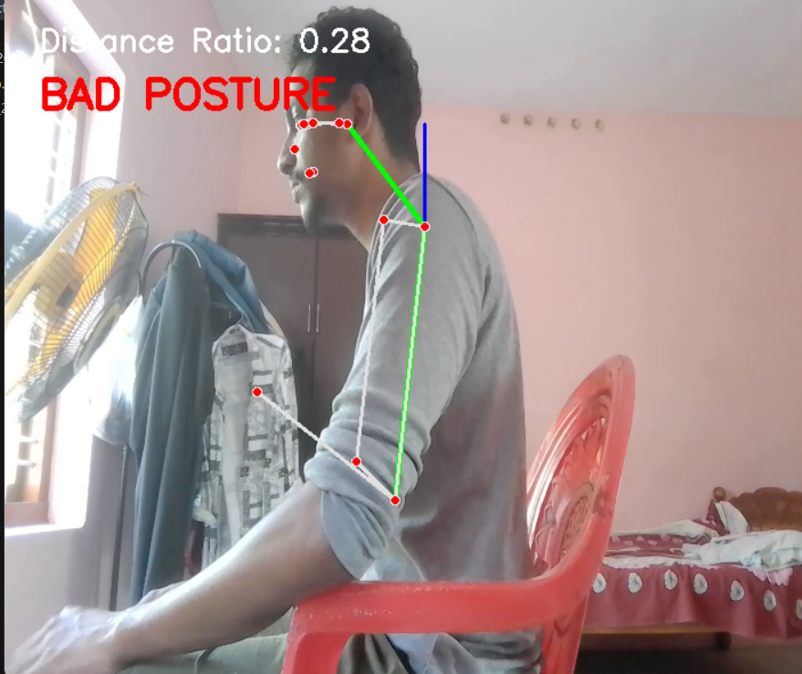

# Neck Posture Checker

A neck posture analysis tool built with Python, OpenCV, and MediaPipe. It detects poor head/neck alignment from a **video file or live webcam feed** and provides live visual feedback.

---

## Demo

The tool overlays pose landmarks and a posture status label directly on the video feed.





```
Distance Ratio: 0.10     → ✅ GOOD POSTURE
Distance Ratio: 0.28     → ❌ BAD POSTURE
```

---

## How It Works

The program uses MediaPipe's Pose estimation to track three key landmarks on the left side of the body:

| Landmark | Role |
|---|---|
| Left Ear | Tracks head position |
| Left Shoulder | Anchor reference point |
| Left Hip | Used for body-scale normalization |

**Posture is evaluated using a distance ratio:**

```
distance_ratio = horizontal_distance(ear, shoulder) / distance(shoulder, hip)
```

- A **high ratio** (> 0.15) means the ear is displaced significantly forward from the shoulder → **BAD POSTURE**
- A **low ratio** (≤ 0.15) means the head is roughly aligned above the shoulder → **GOOD POSTURE**

Normalizing against the shoulder-hip distance makes the metric scale-invariant, so it works regardless of how close or far the person is from the camera.

---

## Getting Started

### Prerequisites

- Python 3.8+
- A video file **or** a webcam (for live detection)

### Installation

```bash
git clone https://github.com/your-username/neck-posture-checker.git
cd neck-posture-checker
pip install -r requirements.txt
```

**`requirements.txt`**

```
opencv-python
mediapipe
```

---

## Input Modes

This tool supports two input modes. Choose based on your use case.

### Mode 1 — Video File (Default)

Place your video file in the project directory and update the path in the script:

```python
video = cv2.VideoCapture("video.mp4")  # path to your video file
```

Then run:

```bash
python posture_checker.py
```

### Mode 2 — Live Webcam

To switch to real-time detection using your webcam, change one line in the script:

```python
# Replace this:
video = cv2.VideoCapture("video.mp4")

# With this:
video = cv2.VideoCapture(0)  # 0 = default webcam, use 1 or 2 for external cameras
```

Then run:

```bash
python posture_checker.py
```

> Press **`Q`** to quit in either mode.

---

## Visual Overlays

The application draws the following on each frame:

| Element | Color | Description |
|---|---|---|
| Ear → Shoulder line | 🟢 Green | Horizontal neck displacement |
| Shoulder → Hip line | 🟢 Green | Body reference axis |
| Vertical reference line | 🔵 Blue | Ideal vertical alignment from shoulder |
| Posture label | 🔴 Red / 🟢 Green | BAD or GOOD posture status |
| Distance ratio | ⚪ White | Normalized numeric score |
| Full pose skeleton | MediaPipe default | All 33 pose landmarks |

---

## Configuration

You can adjust the posture sensitivity threshold directly in the script:

```python
# Lower = stricter, Higher = more lenient
if distance_ratio > 0.15:
    posture = "BAD POSTURE"
```

| Threshold | Behavior |
|---|---|
| `0.10` | Strict — flags slight forward head posture |
| `0.15` | Default — balanced sensitivity |
| `0.20` | Lenient — only flags significant misalignment |

---

## Built With

- [OpenCV](https://opencv.org/) — Video capture and frame rendering
- [MediaPipe](https://mediapipe.dev/) — Pose landmark detection

---

## License

[MIT](LICENSE)
